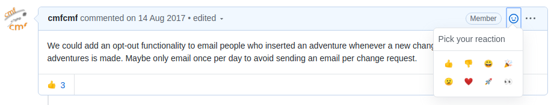
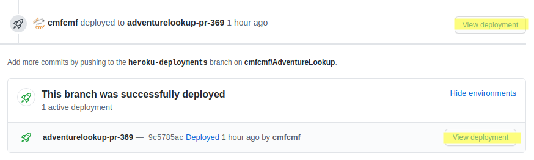

# Contribution Guidelines

First of all, thank you for your interest in contributing to AdventureLookup! :100:

If you have a question, suggestion, feedback or a bug report, don't hesitate to open
a new issue or ask in our [Discord Server](https://discord.gg/0111UjFmfsOzDqan7).

Contributing to AdventureLookup does **not** necessarily require programming experience.
The following sections give an overview of how **You** can contribute. We marked all
sections that don't require programming experience with :gift: and all that require
programming experience with :computer:.

## :gift: Reacting and Commenting on Issues

Commenting on existing issues is a great way to bring the discussion forward.
We want your opinion!

As an example, let's say you find an issue that details
plans to add a cool new feature.
Leave a :+1: or :-1: reaction on the issue to indicate whether you like or
dislike the idea.
Leave a comment if you have any additional thoughts. What could be done differently?
What do you like the most?

Also, please don't feel intimidated to comment on issues. Your input as an
AdventureLookup user is important to us.
Fun fact: It may very well be the case that you use AdventureLookup more regularly
than some of the people who wrote the bulk of the code. :see_no_evil:

## :gift: Creating Issues for Bug Reports, Feature Requests, and Suggestions

You can create [issues](https://github.com/AdventureLookup/AdventureLookup/issues)
for bug reports, features requests and suggestions. Issues are the best way to
discuss those.
Here are a few examples:

- You think that the AdventureLookup page background should be rainbow-colored.
  :arrow_right: Open an issue and briefly explain why you would want that.
- You visited AdventureLookup on a mobile device and found that a certain page
  wasn't optimized for the small phone screen. :arrow_right: Open an issue and
  share a screenshot of the bad page
- You tried to search for an adventure, but the search results didn't at all
  match what you typed into the search bar. :arrow_right: Open an issue and
  explain what search you were performing and what results you were expecting.

## :gift: :computer: Reviewing Pull Requests

[Pull requests](https://github.com/AdventureLookup/AdventureLookup/pulls)
introduce new features and bug fixes into the code. All pull requests
to AdventureLookup are reviewed by at least one person other than the pull
request author. However, the more people that review a pull request, the
higher the chance that the pull request does not introduce new unintentional
bugs. Reviewing a pull request can be split into two tasks:

1. :gift: Real-World Test
   - This part does *not* require programming experience.
   - No pull request review is complete without testing that the code works
     in the real world. Therefore, all pull requests need to be manually
     tested.
   - Read what the pull request author wrote in their first comment. If they
     mention an issue, it is also worth taking a look at that. Then it's time
     to test whether the code changes achieve the goal written in the issue
     and pull request.
   - Each pull request includes a link to *Heroku*, a service we
     use for pull request reviews. By clicking on "View Deployment"
     (highlighed in the screenshot below), you can checkout a preview website
     of that pull request.
     
   - If the pull request introduces a new feature, use the preview website
     to try out the new feature (you can login as `admin` with password
     `asdf`).
     If the pull request fixes a bug, verify that the bug no longer exists.
   - After testing the pull request, leave a comment on the pull request and
     let the author know whether you found a problem or everything worked.
     > :warning: If you get lost while reviewing the PR, please leave a
     > comment on the PR or ask on Discord so that we can help you!
2. :computer: Code Review:
   - This part requires programming experience.
   - Review the code that the pull request changes and try to answer the
     following questions:
     - Is the code understandabnle and well formatted?
     - Does the code include the right amount of comments?
   - Then, comment on the pull request and mention any issues you have with
     the code. If you don't see any issues, please leave a comment that it
     looks good.

## :computer: Working on an Existing Issue

If you see an open issue you'd like to work on, please leave a comment on the issue.
We will then assign you to the issue so everyone knows that you're working on it.

If you run into any problems while working on the issue, please leave a comment so
we can work them out together. It might also make sense to take a look at already
[merged pull requests](https://github.com/AdventureLookup/AdventureLookup/pulls?q=is%3Amerged)
when you don't know where to start. Maybe there has already been a pull request that
tackled a similar issue.

If you haven't already, make sure to setup your development environment using
Gitpod or Vagrant like described in the README. Please open an issue if you run into
issues with setting up your development environment.

Please push your changes to a new branch in your fork and create a pull request
from there. We use forks to keep the main repository free from unnecessary branches.

### :computer: Creating Pull Requests

Please create all pull requests from and against the `dev` branch. The `dev` branch
is always live at https://dev.adventurelookup.com.
We'll merge the `dev` branch into `master` from time to time, which is deployed to
https://adventurelookup.com.

You're welcome to open your pull request early, even if you are still working on the
fix or feature. This way we can give you early feedback on your changes and the
direction you are going. If you open your pull request early, please open it as a
"Draft Pull Request" like shown in
[this blogpost](https://github.blog/2019-02-14-introducing-draft-pull-requests/).
When you're finished, mark the pull request as *Ready for Review*.

### :computer:  Formatting Your Code

We use [prettier](https://prettier.io/) to format all JavaScript and JSX code.
You can run prettier by executing `npm run format`, which automatically adjusts
the code formatting for you. This is also automatically run whenever you make a
commit.

We use [php-cs-fixer](https://cs.symfony.com/) to format all PHP code according
to PSR-1 and PSR-2 and some additional rules. You can run the formatter by
executing `composer run format`, which automatically adjusts the code formatting
for you. This is also automatically run whenever you make a commit.

## :computer: Working on Something Without an Open Issue

Please always create an issue detailing your plans before working on a new
feature. That allows everyone to give feedback on your idea before you spend
a lot of time implementing it.